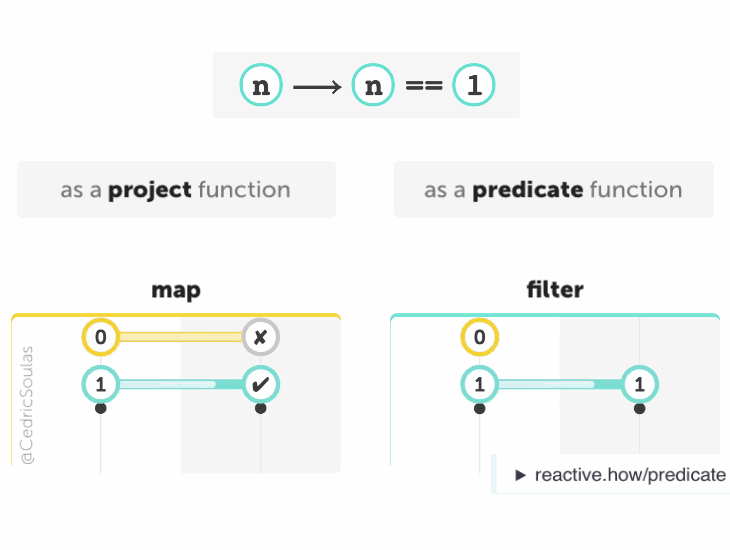

In Reactive Programming, operators take one or several input streams and return a new stream. Some operators may accept additional arguments, such as _functions_:

- _project function_,
- _predicate function_,
- _accumulator function_, etc.

These functions don't have any connection with the input or the output stream: they just transform, compare or combine values. The operators do work with the streams, in conjunction with these functions.

## Project and predicate

A function that:

- takes several <code class="one">values</code>
- and returns one <code class="two">new value</code> of any type

can be used as a **project** function on **combining** operators (eg. [combineLatest](/combineLatest) or [zip](/zip)).

A function that:

- takes one <code class="one">value</code>
- and returns one <code class="two">new value</code> of any type

can be used as a **project** function on **mapping** operators (eg. [map](/map)).

A function that:

- takes one <code class="one">value</code>
- and returns one <code class="two">new value</code> of type `boolean` (`✔ true` or `✘ false`)

can be used as a **predicate** function on **filtering** operators (eg. [filter](/filter), [takeWhile](/takeWhile) or [skipWhile](skipWhile))

As you may have noticed, a function used as a _predicate_ can also be used as _project_ function on _mapping_ operators: 

> {:.w450}

In this example, the function <code class="one">n</code> ⟶ <code class="one">n</code> == <code class="one">1</code>, that returns `✔ true` or `✘ false`, is used both as an argument for _map_ as a project and for _filter_ as a predicate. As a result:

- _map_ returns a new stream of `boolean` values, according to the result of this project function
- _filter_ returns a new stream of filtered values, where the values can pass only if this predicate returns `✔ true`

## Summary

- Some operators may accept functions as arguments. But these functions don't have any connection with the input or the output stream.
-  A function is called a _project_ or a _predicate_ function depending on how you use it with an operator. A function is not a _project_ or _predicate_ function in itself.

Next Monday, we'll continue the exploration of operators and functions with a second part!