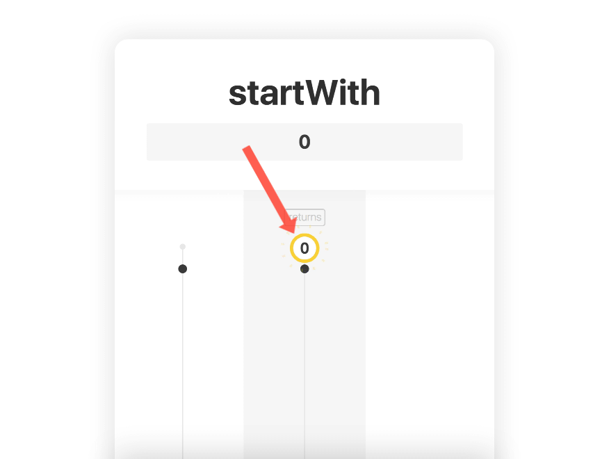
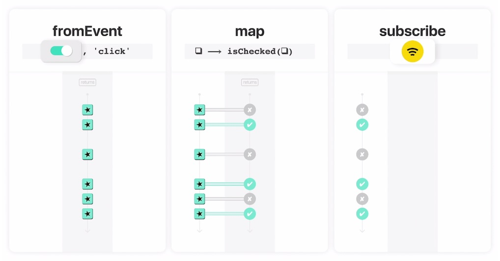

The first event emitted by a stream may happen some time after the stream has started (note: I'll give more details on "how to start a stream" in a future episode).

In many cases, we have to wait for user clicks, for data to load, for an answer to arrive, etc. But, at the same time, we often want to compute or display initial data immediately when the request or the application starts.

Here is a new card: `❚ startWith`. It looks like this:

> {:.w350}

Set an _initial_ value on `❚ startWith`, such as `0`:
- The output stream starts by emitting immediately this _initial_ value.

## Example

In the [Episode 3](/listen) we created a chain of 3 cards. Here is a small excerpt from this episode (or read [the full episode](/listen)):

- `❚ fromEvent` reacts to the `▬ toggle`. It creates a sequence of toggle events over time, **in reaction** to each toggle status change (read [Episode 1](/fromEvent)).
- `❚ map` projects each toggle events to `✘ on` or `✘ off` (read [Episode 2](/map)).
- `❚ subscribe` adds `▬ setWifi` as a **listener** of the stream. This listener accepts `✘ on` or `✘ off` event value and turns the wifi _on_ or _off_ accordingly.

> 
>  <small>[Watch Episode 3 ↗](/listen)</small>

It begins like this:

- the application starts
- after a few seconds, the toggle is turned off by the user
- so, a first event `✘ off` is emitted
- as a result, the listener turns the wifi component _off_
- and so on...

But, from the pure perspective of the event stream, it's not clear what is the status of the wifi component _before_ the first interaction on the toggle. Is the wifi _on_ by default? _off_? maybe in an _undefined/buggy_ state?

I would like the chain of cards to be **responsible for setting the initial state** of the wifi component. To do so, I can add a fourth card to start with an initial `✔ on` event value:

> `❚ fromEvent(toggle)` 
>  ➟`❚ map(isChecked)` 
>  ➟ `❚ startWith(✔)` 
>  ➟`❚ subscribe(setWifi)`

## Conclusion

So, next time you want to display components with initial data, think "reactive" like you did for the rest of your app's life cycle. Instead of using this separated and imperative function to set initial values, couldn't you use `❚ startWith` on this stream you already rely on?

